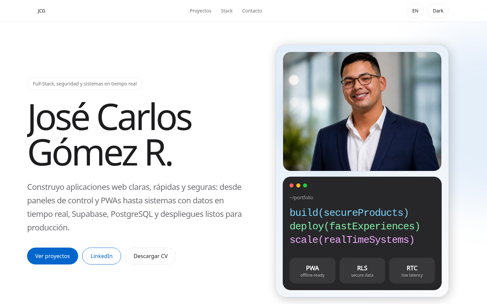
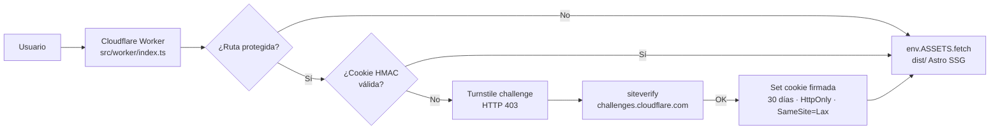
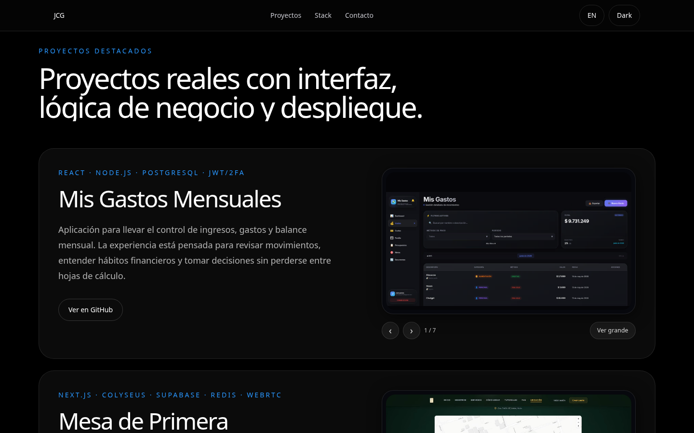
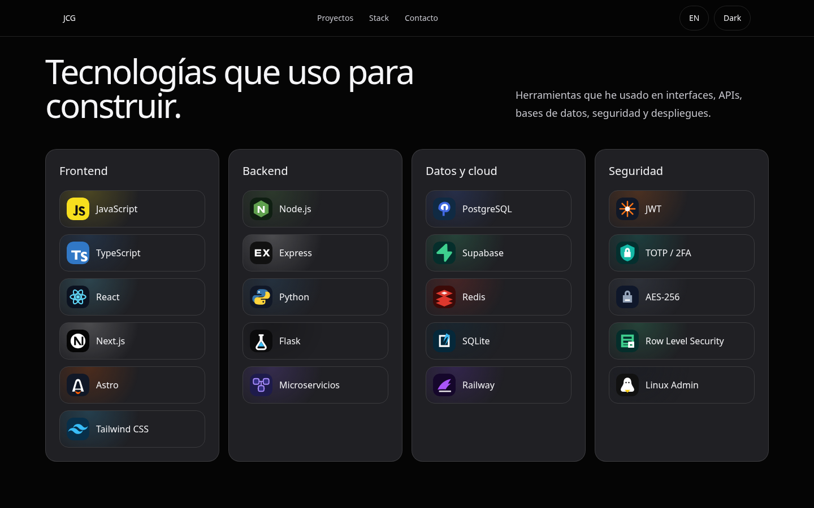
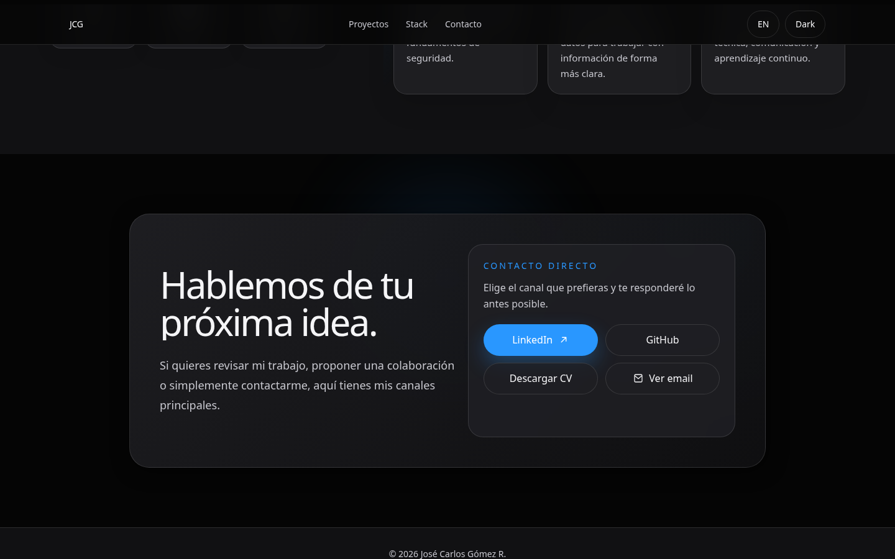
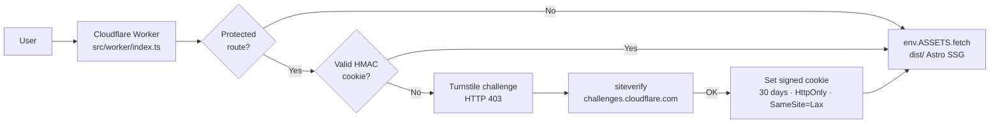

<div align="center">

# José Carlos Gómez R.

**Ingeniero de Software Full-Stack · Portfolio bilingüe (ES / EN)**

[portafoliojosecarlos.com](https://portafoliojosecarlos.com) · [LinkedIn](https://www.linkedin.com/in/josecarlos-gomez-ing) · [GitHub](https://github.com/joseCarlos1342) · [CV (requiere verificación Turnstile)](https://portafoliojosecarlos.com/__download-cv)

<br/>

[](https://github.com/joseCarlos1342/miportafolio/actions/workflows/deploy.yml)
[](LICENSE)
[](https://nodejs.org)
[](vitest.config.ts)
[](https://astro.build)
[](https://tailwindcss.com)
[](tsconfig.json)

<br/>

<picture>
  <source media="(prefers-color-scheme: dark)" srcset="docs/assets/readme/banner-dark.png">
  
</picture>

</div>

<br/>

> **Idiomas / Languages:** [Espanol](#espanol) · [English](#english)

---

<a id="espanol"></a>

## Espanol

Portfolio personal bilingüe (Español / Inglés) construido con **Astro 6** y desplegado en **Cloudflare Workers** como sitio estático, con un **Cloudflare Worker** que protege contra scraping las rutas sensibles (email de contacto y descarga de CV) usando **Cloudflare Turnstile** y cookies firmadas con **HMAC-SHA256**.

El sitio se centra en la claridad, el rendimiento y la seguridad: cero JavaScript de framework en runtime, animaciones con GSAP detrás de `prefers-reduced-motion`, imágenes responsivas con `<picture>` (AVIF + WebP + PNG), y un PWA instalable.

### Demo en vivo

**[portafoliojosecarlos.com](https://portafoliojosecarlos.com)** — sitio público, sin tracking, sirviendo HTML estático desde el edge de Cloudflare.

### Características

- **SSG con Astro 6** — sitio estático, sin framework JS en el cliente.
- **i18n ES / EN** — toggle sin recargar, atributos `data-es` / `data-en` en cada string visible.
- **Modo claro / oscuro** — persistido en `localStorage`, sin FOUC (script anti-FOUC inline en `<head>`).
- **Anti-scraping con Cloudflare Turnstile** — protege el email de contacto y la descarga del CV.
- **Cookies HMAC-SHA256 firmadas** — `timingSafeEqual` para comparar, `HttpOnly` + `Secure` + `SameSite=Lax`, expiración 30 días.
- **Open Redirect sanitization** en los callbacks del challenge.
- **100% de cobertura** en `src/worker/` (gate en CI vía Istanbul/Vitest con `perFile: true`).
- **E2E con Playwright** — Chromium + Firefox + mobile-Chrome contra el build de `astro preview`.
- **SEO completo** — Open Graph (1200×630), Twitter Card, JSON-LD `Person` + `WebSite`, `sitemap.xml`, `robots.txt`, `llms.txt`, `humans.txt`.
- **PWA** — `site.webmanifest`, iconos 192/512, soporte offline-friendly.
- **TypeScript strict** — extiende `astro/tsconfigs/strict`.
- **Animaciones GSAP** — reveal-on-scroll, magnetic buttons, 3D tilt en project cards, todo detrás de `prefers-reduced-motion`.

### Proyectos destacados

| Proyecto | Stack | Descripción | Repo |
|---|---|---|---|
| **Mis Gastos Mensuales** | React · Node.js · PostgreSQL · JWT/2FA | Control de ingresos, gastos y balance mensual con autenticación segura. | Privado (disponible bajo pedido) |
| **Mesa de Primera** | Next.js · Colyseus · Supabase · Redis · WebRTC | Juego de cartas multijugador en tiempo real con motor autoritativo, PWA y panel admin. | [GitHub](https://github.com/joseCarlos1342/Mesa_primera) |
| **Sistema de Préstamos Personales** | Python · Flask · SQLite · AES-256 · Backups | Panel para clientes, préstamos, alertas, flujo de caja y backups automáticos. | Privado (disponible bajo pedido) |

### Stack tecnológico

| Tecnología | Versión | Licencia | Uso |
|---|---|---|---|
| [Astro](https://astro.build) | ^6.3.3 | MIT | Framework SSG |
| [Tailwind CSS](https://tailwindcss.com) | ^4.3.0 | MIT | Estilos (utility-first) |
| [GSAP](https://gsap.com) | ^3.15.0 | GSAP Standard | Animaciones |
| [Wrangler](https://developers.cloudflare.com/workers/wrangler/) | ^4.100.0 | MIT | Deploy CLI |
| [Cloudflare Turnstile](https://developers.cloudflare.com/turnstile/) | — | Cloudflare ToS | Anti-bot |
| [Vitest](https://vitest.dev) | ^4.1.9 | MIT | Tests unit + integración |
| [Playwright](https://playwright.dev) | ^1.61.0 | Apache-2.0 | Tests E2E |
| TypeScript | ^5.x | Apache-2.0 | Lenguaje (strict) |

**Requisitos:** Node.js >= 22.12.0

### Arquitectura

El sitio tiene dos capas: un **Astro SSG** que genera el HTML estático, y un **Cloudflare Worker** (`src/worker/index.ts`, módulo con `lib/`, `routes/`, `pages/`, `types.ts`) que se ejecuta antes que los assets (`run_worker_first: true`) e intercepta las rutas protegidas.



Detalle completo en [`docs/ARCHITECTURE.md`](docs/ARCHITECTURE.md).

### Capturas

#### Sección de proyectos (carousel de capturas + video de gameplay + lightbox)


#### Stack visual con iconos por categoría (Frontend, Backend, Datos y cloud, Seguridad)


#### Sección de contacto con canales directos y descarga de CV protegida


### Estructura del proyecto

```
miportafolio/
├── .github/
│   ├── ISSUE_TEMPLATE/          # Plantillas de bugs y feature requests
│   ├── PULL_REQUEST_TEMPLATE.md
│   └── workflows/
│       └── deploy.yml           # CI/CD: tests → build → deploy a Cloudflare
├── docs/
│   ├── adr/                     # Architecture Decision Records (3 ADRs)
│   ├── assets/readme/           # Capturas del README (este archivo)
│   ├── ARCHITECTURE.md          # Arquitectura detallada
│   ├── DEPLOYMENT.md            # CI/CD, secrets, troubleshooting
│   ├── DESIGN.md                # Sistema de diseño (formato Google design.md)
│   ├── ENVIRONMENT.md           # Variables de entorno
│   ├── SECURITY.md              # Modelo de seguridad, Turnstile, cookies HMAC
│   ├── SEO.md                   # OG, Twitter, JSON-LD, sitemap
│   ├── PERFORMANCE.md           # Optimización de imágenes, video, fonts
│   ├── ACCESSIBILITY.md         # WCAG 2.1 AA, ARIA, reduced-motion
│   ├── CONTENT.md               # Guía para agregar proyectos, i18n, assets
│   └── TESTING.md               # Estrategia de tests
├── public/
│   ├── tech/                    # Iconos SVG de tecnologías (21 íconos)
│   ├── education/               # Logos de instituciones educativas
│   ├── projects/                # Capturas y videos de proyectos
│   ├── docs/                    # CV en PDF (protegido por Turnstile)
│   ├── favicon.svg / .ico       # Favicon y PWA icons
│   ├── og-image.png / .svg      # Open Graph image (1200×630)
│   ├── robots.txt, sitemap.xml
│   ├── site.webmanifest         # PWA manifest
│   ├── llms.txt                 # Índice para modelos de IA
│   ├── llms-full.txt            # Contenido completo para IA
│   └── humans.txt               # Créditos legibles por humanos
├── scripts/
│   ├── generate-icons.cjs       # Genera iconos PWA desde favicon.svg
│   ├── generate-ico.cjs         # Genera favicon.ico
│   └── optimize-readme-shots.mjs # Optimiza capturas del README
├── src/
│   ├── components/              # Componentes Astro reutilizables (ui/, sections/, seo/, nav/, i18n/, theme/, projects/)
│   ├── data/                    # Datos tipados (site, projects, education, skills, nav, i18n/strings)
│   ├── layouts/                 # Layouts (BaseLayout)
│   ├── pages/
│   │   └── index.astro          # Página única (hero, about, skills, projects, education, contact)
│   ├── scripts/                 # TypeScript cliente (i18n, theme, carousel, lightbox, animations/)
│   ├── styles/                  # tokens.css + global.css (design tokens, tema, componentes)
│   ├── types/                   # Tipos compartidos (Project, SkillGroup, Locale...)
│   └── worker/                  # Cloudflare Worker modular
│       ├── index.ts             # Entry point + barrel re-exports
│       ├── types.ts             # Env + constantes (rutas, cookie, siteverify URL)
│       ├── lib/                 # Helpers puros (escape-html, sanitize-redirect, crypto, cookie, is-protected-path...)
│       ├── routes/              # turnstile-verify.ts, protected.ts
│       └── pages/               # HTML renderers (challenge.ts, email.ts)
├── tests/
│   ├── e2e/                     # Playwright: E2E de la UI pública
│   ├── fixtures/                # JSON fixtures para tests
│   └── unit/
│       ├── worker/              # Vitest: unit + integration tests del Worker
│       └── data/                # Reservado para tests de data-shape
├── astro.config.mjs             # Configuración Astro (output: static, Tailwind Vite)
├── vitest.config.ts             # Vitest + pool-workers + gate cobertura 100% en src/worker/**
├── playwright.config.ts         # Playwright (chromium + firefox + mobile-chrome)
├── wrangler.jsonc               # Configuración Cloudflare Workers
├── tsconfig.json                # TypeScript strict (extends astro/tsconfigs/strict)
└── package.json
```

### Desarrollo local

```sh
npm install
npm run dev
```

El sitio estará disponible en `http://localhost:4321`.

### Build

```sh
npm run build
```

El output estático se genera en `dist/`.

### Variables de entorno

Ver documentación completa en [`docs/ENVIRONMENT.md`](docs/ENVIRONMENT.md).

| Variable | Tipo | Origen | Descripción |
|---|---|---|---|
| `PUBLIC_TURNSTILE_SITE_KEY` | Pública | `wrangler.jsonc` vars | Site key del widget Turnstile |
| `TURNSTILE_SECRET_KEY` | Secreto | `wrangler secret put` | Secret key para validar tokens |
| `COOKIE_SECRET` | Secreto | `wrangler secret put` | Clave HMAC para firmar cookies |
| `CONTACT_EMAIL` | Secreto | `wrangler secret put` | Email de contacto (protegido) |
| `CLOUDFLARE_API_TOKEN` | CI | GitHub Secrets | Token para deploy desde CI |
| `CLOUDFLARE_ACCOUNT_ID` | CI | GitHub Secrets | Account ID para deploy desde CI |

### Despliegue

El despliegue es automático vía GitHub Actions al hacer push a `master`. Ver [`docs/DEPLOYMENT.md`](docs/DEPLOYMENT.md) para detalle.

```sh
# Despliegue manual (alternativo)
npm run build
npx wrangler deploy
```

### Rutas protegidas por Turnstile

El Worker en `src/worker/` protege **únicamente** tres rutas:

| Ruta | Método | Descripción |
|---|---|---|
| `/__contact-email` | GET | Página con el email de contacto |
| `/__download-cv` | GET | Descarga del CV en PDF |
| `/docs/cv-jose-carlos-gomez.pdf` | GET | Archivo PDF del CV |

El resto del sitio (HTML, CSS, JS, imágenes, fuentes) se sirve públicamente sin verificación.

**Flujo:**
1. El usuario accede a una ruta protegida.
2. Si no tiene cookie válida, el Worker devuelve una página con el widget Turnstile (HTTP 403).
3. Al completar el challenge, el Worker valida el token contra `challenges.cloudflare.com/turnstile/v0/siteverify`.
4. Si la validación pasa, se establece una cookie `HttpOnly`, `Secure`, `SameSite=Lax` por 30 días.
5. Las visitas posteriores con cookie válida acceden directamente al contenido protegido.

Más detalle en [`docs/SECURITY.md`](docs/SECURITY.md).

### Testing

```sh
npm test                    # unit + integración (Vitest + pool-workers)
npm run test:coverage       # gate 100% en src/worker/**
npm run test:e2e            # E2E (Playwright: chromium + firefox + mobile)
```

Ver documentación completa en [`docs/TESTING.md`](docs/TESTING.md).

### Documentación adicional

| Documento | Descripción |
|---|---|
| [docs/DESIGN.md](docs/DESIGN.md) | Sistema de diseño (formato Google design.md, validado con `@google/design.md lint`) |
| [docs/adr/](docs/adr/) | Architecture Decision Records (3 ADRs: static Astro, Cloudflare Worker, Turnstile protection) |
| [docs/ARCHITECTURE.md](docs/ARCHITECTURE.md) | Arquitectura: Astro SSG + Cloudflare Worker |
| [docs/TESTING.md](docs/TESTING.md) | Estrategia de pruebas: Vitest + Playwright, cobertura 100% en `worker.ts` |
| [docs/DEPLOYMENT.md](docs/DEPLOYMENT.md) | CI/CD con GitHub Actions, secrets, troubleshooting |
| [docs/ENVIRONMENT.md](docs/ENVIRONMENT.md) | Tabla completa de variables de entorno |
| [docs/SECURITY.md](docs/SECURITY.md) | Modelo de seguridad, Turnstile, cookies HMAC |
| [docs/SEO.md](docs/SEO.md) | Open Graph, JSON-LD, sitemap, robots, `llms.txt` |
| [docs/PERFORMANCE.md](docs/PERFORMANCE.md) | Optimización de imágenes, video, fonts |
| [docs/ACCESSIBILITY.md](docs/ACCESSIBILITY.md) | WCAG 2.1 AA, ARIA, `reduced-motion`, focus management |
| [docs/CONTENT.md](docs/CONTENT.md) | Guía para agregar proyectos, i18n, assets |
| [CHANGELOG.md](CHANGELOG.md) | Historial de versiones |
| [CONTRIBUTING.md](CONTRIBUTING.md) | Guía de contribución |

### Tarjeta social (Open Graph)

Así se ve el sitio al ser compartido en redes sociales (1200×630):


### Contribuir

Las contribuciones son bienvenidas. Ver [CONTRIBUTING.md](CONTRIBUTING.md) para detalle sobre estilo de código, convenciones de commit y sistema de diseño.

### Autor

**José Carlos Gómez R.** — Ingeniero de Software Full-Stack.

- [LinkedIn](https://www.linkedin.com/in/josecarlos-gomez-ing)
- [GitHub](https://github.com/joseCarlos1342)
- [portafoliojosecarlos.com](https://portafoliojosecarlos.com)

### Licencia

Este proyecto está licenciado bajo **MIT License**. Ver [LICENSE](LICENSE).

Las tecnologías de terceros (Astro, Tailwind CSS, GSAP, Wrangler, Cloudflare Turnstile) mantienen sus propias licencias. Los logos y marcas (Apple, Cisco, SENA, Python Institute, LinkedIn, GitHub, Cloudflare) pertenecen a sus respectivos dueños y se referencian nominalmente con fines educativos y de atribución profesional.

---

<a id="english"></a>

## English

Bilingual (Spanish / English) personal portfolio built with **Astro 6** and deployed to **Cloudflare Workers** as a static site, with a **Cloudflare Worker** that protects the contact email and CV download routes against scraping using **Cloudflare Turnstile** and **HMAC-SHA256**-signed cookies.

The site focuses on clarity, performance and security: zero framework JS at runtime, GSAP animations behind `prefers-reduced-motion`, responsive images with `<picture>` (AVIF + WebP + PNG), and an installable PWA.

### Live demo

**[portafoliojosecarlos.com](https://portafoliojosecarlos.com)** — public site, no tracking, serving static HTML from the Cloudflare edge.

### Features

- **SSG with Astro 6** — static site, no framework JS on the client.
- **i18n ES / EN** — toggle without reload, `data-es` / `data-en` attributes on every visible string.
- **Light / dark mode** — persisted in `localStorage`, no FOUC (anti-FOUC inline script in `<head>`).
- **Anti-scraping with Cloudflare Turnstile** — protects the contact email and CV download.
- **HMAC-SHA256 signed cookies** — `timingSafeEqual` for comparison, `HttpOnly` + `Secure` + `SameSite=Lax`, 30-day expiration.
- **Open Redirect sanitization** on challenge callbacks.
- **100% coverage** on `src/worker/` (CI gate via Istanbul/Vitest with `perFile: true`).
- **E2E with Playwright** — Chromium + Firefox + mobile-Chrome against `astro preview` build.
- **Complete SEO** — Open Graph (1200×630), Twitter Card, JSON-LD `Person` + `WebSite`, `sitemap.xml`, `robots.txt`, `llms.txt`, `humans.txt`.
- **PWA** — `site.webmanifest`, 192/512 icons, offline-friendly.
- **TypeScript strict** — extends `astro/tsconfigs/strict`.
- **GSAP animations** — reveal-on-scroll, magnetic buttons, 3D tilt on project cards, all behind `prefers-reduced-motion`.

### Featured projects

| Project | Stack | Description | Repo |
|---|---|---|---|
| **Mis Gastos Mensuales** | React · Node.js · PostgreSQL · JWT/2FA | Monthly income, expenses and balance tracker with secure auth. | [GitHub](https://github.com/joseCarlos1342/Mis_gastos_mensuales) |
| **Mesa de Primera** | Next.js · Colyseus · Supabase · Redis · WebRTC | Real-time multiplayer card game with authoritative server engine, PWA, admin panel. | [GitHub](https://github.com/joseCarlos1342/Mesa_primera) |
| **Personal Loan System** | Python · Flask · SQLite · AES-256 | Dashboard for clients, loans, alerts, cash flow and automated backups. | [GitHub](https://github.com/joseCarlos1342/Sistema_prestamos_personales) |

### Tech stack

| Technology | Version | License | Purpose |
|---|---|---|---|
| [Astro](https://astro.build) | ^6.3.3 | MIT | SSG framework |
| [Tailwind CSS](https://tailwindcss.com) | ^4.3.0 | MIT | Styling (utility-first) |
| [GSAP](https://gsap.com) | ^3.15.0 | GSAP Standard | Animations |
| [Wrangler](https://developers.cloudflare.com/workers/wrangler/) | ^4.100.0 | MIT | Deploy CLI |
| [Cloudflare Turnstile](https://developers.cloudflare.com/turnstile/) | — | Cloudflare ToS | Anti-bot |
| [Vitest](https://vitest.dev) | ^4.1.9 | MIT | Unit + integration tests |
| [Playwright](https://playwright.dev) | ^1.61.0 | Apache-2.0 | E2E tests |
| TypeScript | ^5.x | Apache-2.0 | Language (strict) |

**Requirements:** Node.js >= 22.12.0

### Architecture

The site has two layers: an **Astro SSG** that generates static HTML, and a **Cloudflare Worker** (`src/worker/index.ts`, module with `lib/`, `routes/`, `pages/`, `types.ts`) that runs before the assets (`run_worker_first: true`) and intercepts the protected routes.



Full detail in [`docs/ARCHITECTURE.md`](docs/ARCHITECTURE.md).

### Screenshots

See the [Spanish section above](#espanol) for inline screenshots of the projects, stack and contact sections.

### Project structure

See the [Spanish section above](#espanol) for the full directory tree.

### Local development

```sh
npm install
npm run dev
```

The site will be available at `http://localhost:4321`.

### Build

```sh
npm run build
```

Static output is generated in `dist/`.

### Environment variables

See full documentation in [`docs/ENVIRONMENT.md`](docs/ENVIRONMENT.md).

| Variable | Type | Source | Description |
|---|---|---|---|
| `PUBLIC_TURNSTILE_SITE_KEY` | Public | `wrangler.jsonc` vars | Turnstile widget site key |
| `TURNSTILE_SECRET_KEY` | Secret | `wrangler secret put` | Secret key to validate tokens |
| `COOKIE_SECRET` | Secret | `wrangler secret put` | HMAC key to sign cookies |
| `CONTACT_EMAIL` | Secret | `wrangler secret put` | Contact email (protected) |
| `CLOUDFLARE_API_TOKEN` | CI | GitHub Secrets | Token for CI deploy |
| `CLOUDFLARE_ACCOUNT_ID` | CI | GitHub Secrets | Account ID for CI deploy |

### Deployment

Deployment is automatic via GitHub Actions on push to `master`. See [`docs/DEPLOYMENT.md`](docs/DEPLOYMENT.md) for detail.

```sh
# Manual deployment (alternative)
npm run build
npx wrangler deploy
```

### Turnstile-protected routes

The Worker in `src/worker/` protects **only** three routes:

| Route | Method | Description |
|---|---|---|
| `/__contact-email` | GET | Page with contact email |
| `/__download-cv` | GET | CV PDF download |
| `/docs/cv-jose-carlos-gomez.pdf` | GET | CV PDF file |

The rest of the site (HTML, CSS, JS, images, fonts) is served publicly without verification.

**Flow:** same as Spanish section above.

### Testing

```sh
npm test                    # unit + integration (Vitest + pool-workers)
npm run test:coverage       # 100% gate on src/worker/**
npm run test:e2e            # E2E (Playwright: chromium + firefox + mobile)
```

See full documentation in [`docs/TESTING.md`](docs/TESTING.md).

### Additional documentation

See the [Spanish section above](#espanol) for the complete documentation index (11 documents covering architecture, security, SEO, performance, accessibility, content, testing, deployment, environment, design system and changelog).

### Social card (Open Graph)

See the [Spanish section above](#espanol) for the embedded Open Graph image (1200×630).

### Contributing

Contributions are welcome. See [CONTRIBUTING.md](CONTRIBUTING.md) for details on code style, commit conventions and the design system.

### Author

**José Carlos Gómez R.** — Full-Stack Software Engineer.

- [LinkedIn](https://www.linkedin.com/in/josecarlos-gomez-ing)
- [GitHub](https://github.com/joseCarlos1342)
- [portafoliojosecarlos.com](https://portafoliojosecarlos.com)

### License

This project is licensed under the **MIT License**. See [LICENSE](LICENSE).

Third-party technologies (Astro, Tailwind CSS, GSAP, Wrangler, Cloudflare Turnstile) retain their own licenses. Logos and trademarks (Apple, Cisco, SENA, Python Institute, LinkedIn, GitHub, Cloudflare) belong to their respective owners and are referenced nominatively for educational and professional attribution purposes only.
